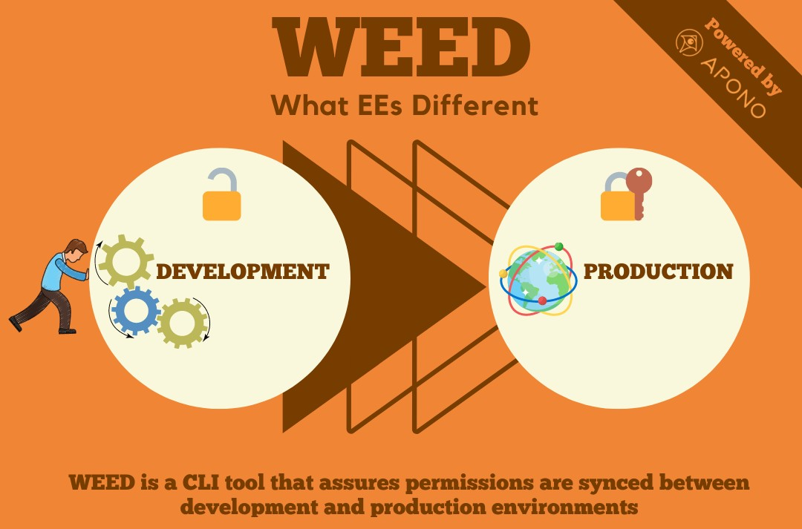

# WEED - What EEs Different - IAM role diff checker
## Prevent runtime errors in production ahead of time!

Have you ever pushed to production only to find out that the permissions between staging and production environments are out of sync? resulting in access errors in a live environment? 
Well we have, we got frustrated, learned and created WEED!!!

## What is WEED?

WEED is a CLI tool that assures permissions are synced between different environments.
WEED Checks for permission differences between requested permissions in an environment to current environment.
WEED maps permissions on both environments checking for discrepancies that might cause access errors in production

### Components

***WEED CLI***  -
Discovers Diff in permissions between environments to avoid those pesky 403 errors in production.
Can be used to verify permissions manually or as part of the CI CD cycle.

***IAM Enforcer – Kubernetes Admission Controller*** –
Intercepts API requests to k8s api-server and acts as a validation layer, assuring all requested permissions are available before applying the changes.

### Prerequisites

- AWS Account
- Role in AWS

## Getting Started
Installation instruction for the Kubernetes integrations are available [here](docs/k8s-integration.md), instruction for the CLI tool are available [here](docs/cli.md).

